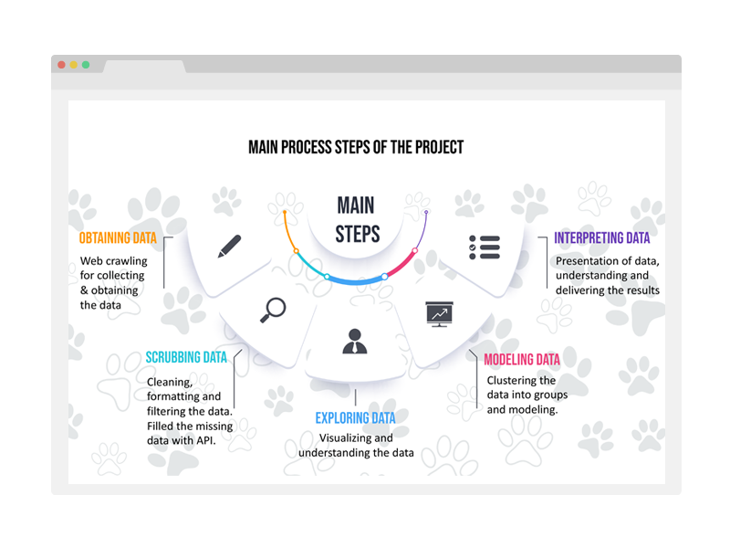

<!-- [![Contributors][contributors-shield]][contributors-url]
[![Forks][forks-shield]][forks-url]
[![Stargazers][stars-shield]][stars-url]
[![Issues][issues-shield]][issues-url]
[![MIT License][license-shield]][license-url]
[![LinkedIn][linkedin-shield]][linkedin-url]

 -->

<!-- PROJECT LOGO -->
<br />
<p align="center">
  <a href="https://github.com/niv656/Dog-Breeds-Data-Science-Project">
    
  </a>

  <h3 align="center">Dog Breeds | Data Science Project</h3>

  <p align="center">
    Dog Breed Classification
    <br />
    <a href="https://github.com/niv656/Dog-Breeds-Data-Science-Project"><strong>Explore the docs »</strong></a>
    <br />
    <br />
    <a href="https://github.com/niv656/Dog-Breeds-Data-Science-Project">View Demo</a>
    ·
    <a href="https://github.com/niv656/Dog-Breeds-Data-Science-Project/issues">Report Bug</a>
    ·
    <a href="https://github.com/niv656/Dog-Breeds-Data-Science-Project/issues">Request Feature</a>
  </p>
</p>


<!-- ABOUT THE PROJECT -->
## About The Project



<!-- title:
**description:**
`github_username`, `repo_name`, `twitter_handle`, `email`, `project_title`, `project_description` -->


### Built With

* [BeautifulSoup4](https://pypi.org/project/beautifulsoup4/)
* [The Dog API](https://thedogapi.com)


<!-- GETTING STARTED -->
## Getting Started

To get a local copy up and running follow these simple steps.

### Installation

1. Clone the repo
   ```sh
   git clone https://github.com/niv656/Dog-Breeds-Data-Science-Project.git
   ```

<!-- CONTRIBUTING -->
## Contributing

Contributions are what make the open source community such an amazing place to be learn, inspire, and create. Any contributions you make are **greatly appreciated**.

1. Fork the Project
2. Create your Feature Branch (`git checkout -b feature/AmazingFeature`)
3. Commit your Changes (`git commit -m 'Add some AmazingFeature'`)
4. Push to the Branch (`git push origin feature/AmazingFeature`)
5. Open a Pull Request


<!-- CONTACT -->
## Contact

Niv Huga - [@HugaNiv](https://twitter.com/HugaNiv) - niv656@gmail.com
Yarden Gispan - Yargisp@gmail.com

<!-- MARKDOWN LINKS & IMAGES -->
<!-- https://www.markdownguide.org/basic-syntax/#reference-style-links -->
[contributors-shield]: https://img.shields.io/github/contributors/github_username/repo.svg?style=for-the-badge
[contributors-url]: https://github.com/github_username/repo/graphs/contributors
[forks-shield]: https://img.shields.io/github/forks/github_username/repo.svg?style=for-the-badge
[forks-url]: https://github.com/github_username/repo/network/members
[stars-shield]: https://img.shields.io/github/stars/github_username/repo.svg?style=for-the-badge
[stars-url]: https://github.com/github_username/repo/stargazers
[issues-shield]: https://img.shields.io/github/issues/github_username/repo.svg?style=for-the-badge
[issues-url]: https://github.com/github_username/repo/issues
[license-shield]: https://img.shields.io/github/license/github_username/repo.svg?style=for-the-badge
[license-url]: https://github.com/github_username/repo/blob/master/LICENSE.txt
[linkedin-shield]: https://img.shields.io/badge/-LinkedIn-black.svg?style=for-the-badge&logo=linkedin&colorB=555
[linkedin-url]: https://linkedin.com/in/github_username
